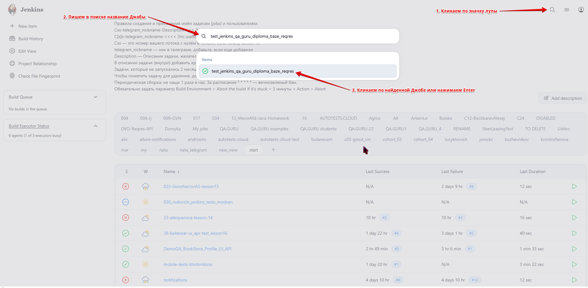
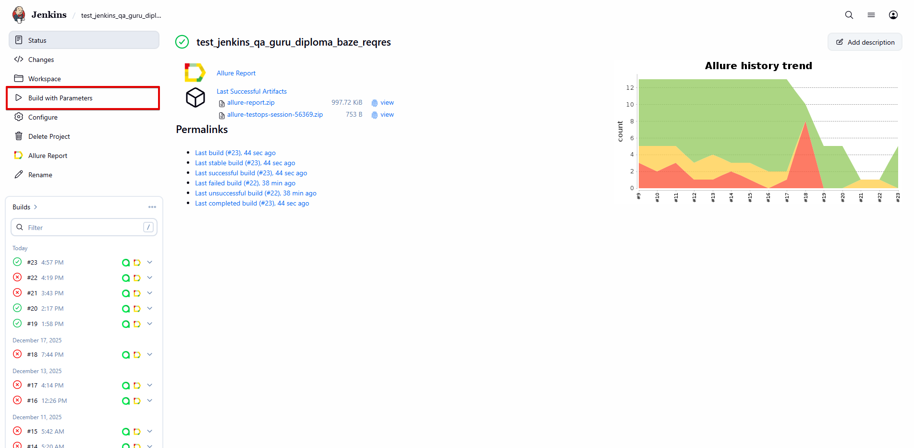
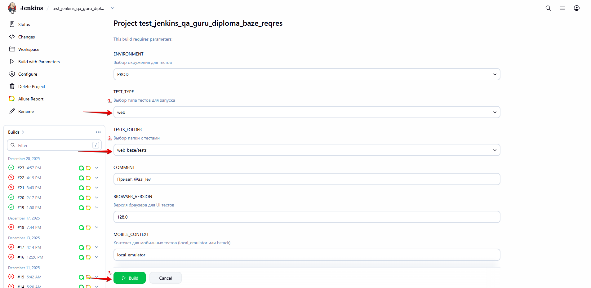
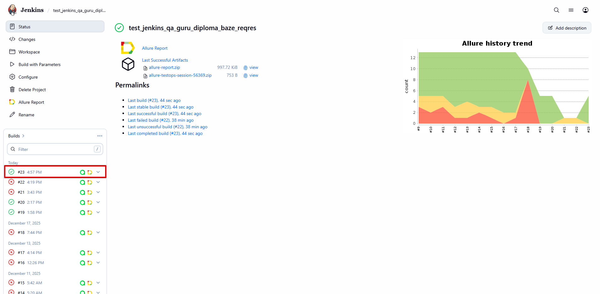

#  Дипломный WEB / Mobile проект тестирования РП проекта BAZE + API Reqres.in с использованием Python, Pytest, Selene, Allure, Jenkins, Selenoid, Allure TestOps, Jira.

---
## 📋 О проекте

---
Данный проект представляет собой фреймворк для UI-тестирования веб-сайта '[BAZE RP](https://bazerp.com/)', Mobile тестирования приложения '[BAZE Mobile](https://bazemobile.com/)', API тестирования сервиса '[Reqres.in](https://reqres.in/)'.

---
## 🛠️ Технологии и инструменты

---
        <code></code>  

---
## 🔍 Область тестирования

---
Охватывает смоук и регрессионные сценарии для:

UI тестов:
- Header - проверка 'шапки' сайта на всех страницах для авторизованного и неавторизованного пользователя.

- Footer - проверка 'подвала' сайта на всех страницах.

- Раздел 'Ключевые особенности' - валидация контента и его функциональности.

- Навигация - клик по кнопке 'Начать игру' с переходом в раздел 'Как начать играть' и проверкой ссылок.

- Авторизация - позитивная проверка входа в аккаунт.

Mobile тестов:
- Авторизация в режиме гостя

- Проверка разделов Главного меню

API тестов:
- Создание пользователя
- Получение информации о пользователе
- Обновление информации о пользователе
- Удаление пользователя
- Неуспешная регистрация пользователя

---
###  Запуск UI тестов локально

---
**1.** Клонирование репозитория:

`git clone https://github.com/QAlexandraLevina/qa_guru_diploma_baze_reqres.git`

**2.** Установка зависимостей:

`pip install -r requirements.txt`

**3.** Запуск UI тестов с генерацией отчёта Allure:

`pytest web_baze/tests/ -v --alluredir=allure-results`

**4.** Просмотр Allure отчёта:

`allure serve allure-results`

---
###  Запуск Mobile тестов локально

---
**1.** Клонирование репозитория:

`git clone https://github.com/QAlexandraLevina/qa_guru_diploma_baze_reqres.git`

**2.** Установка зависимостей:

`pip install -r requirements.txt`

**3.** Предварительные требования (должны быть установлены):

- Appium Server (версия 2.x)

- Android Studio с эмулятором

- Созданный эмулятор (рекомендуется: Google Pixel 8, Android 16.0)

- APK файл приложения BAZE RP Mobile

**4.** Настройка конфигурации эмулятора:

- Файл .env.local_emulator уже содержит настройки для эмулятора.
- Проверка/обновление пути к APK файлу в строке:

`APP=ваш_локальный_путь_к_apk_файлу`

Пример: 

Windows:
`APP=C:\Users\Имя\Downloads\com.bazemobile.main.apk`

macOS/Linux:
`APP=/Users/Имя/Downloads/com.bazemobile.main.apk`

**5.** Запуск Appium сервера (в отдельном терминале):

`appium`

Должно появиться:

`[Appium] Welcome to Appium v2.x.x`

`[Appium] Appium REST http interface listener started on 0.0.0.0:4723`

**6.** Запуск Android эмулятора:

- Открыть Android Studio

- Запустить эмулятор Pixel 8 (Android 16.0)

Проверка в терминале, что эмулятор запущен:

`adb devices`

- Должно появиться: 

`List of devices attached`

`emulator-5554   device`

**7.** Запуск Mobile тестов с генерацией отчёта Allure:

`pytest mobile_baze/tests/ -v --alluredir=allure-results --context=local_emulator`

**8.** Просмотр Allure отчёта:

`allure serve allure-results`

---
###  Запуск API тестов локально

---
**1.** Клонирование репозитория:

`git clone https://github.com/QAlexandraLevina/qa_guru_diploma_baze_reqres.git`

**2.** Установка зависимостей:

`pip install -r requirements.txt`

**3.** Запуск API тестов с генерацией отчёта Allure:

`pytest api_reqres/tests/ -v --alluredir=allure-results`

**4.** Просмотр Allure отчёта:

`allure serve allure-results`

---
###  Запуск тестов на удалённом сервере Jenkins

---
**1.** Авторизоваться в '[Jenkins](https://jenkins.autotests.cloud/)'.

**2.** Перейти в Джобу: `test_jenkins_qa_guru_diploma_baze_reqres`.

**3.** Нажать 'Build with Parameters' на панели слева для запуска тестов.

**4.** Выбрать параметры сборки для запуска тестов и нажать 'Build'.

**5.** После завершения сборки открыть Allure-отчёт, кликнув на соответствующую иконку:

---
### 📊 Визуализация отчётов с результатами (Allure Report, Allure TestOps, Jira, Telegram)

---
####  **Allure Report**

#### <code></code> **[Allure TestOps](https://allure.autotests.cloud/project/5034/dashboards)**

####  **[Jira](https://jira.autotests.cloud/browse/HOMEWORK-1562?filter=allissues)**

####  **Telegram Notifications**

